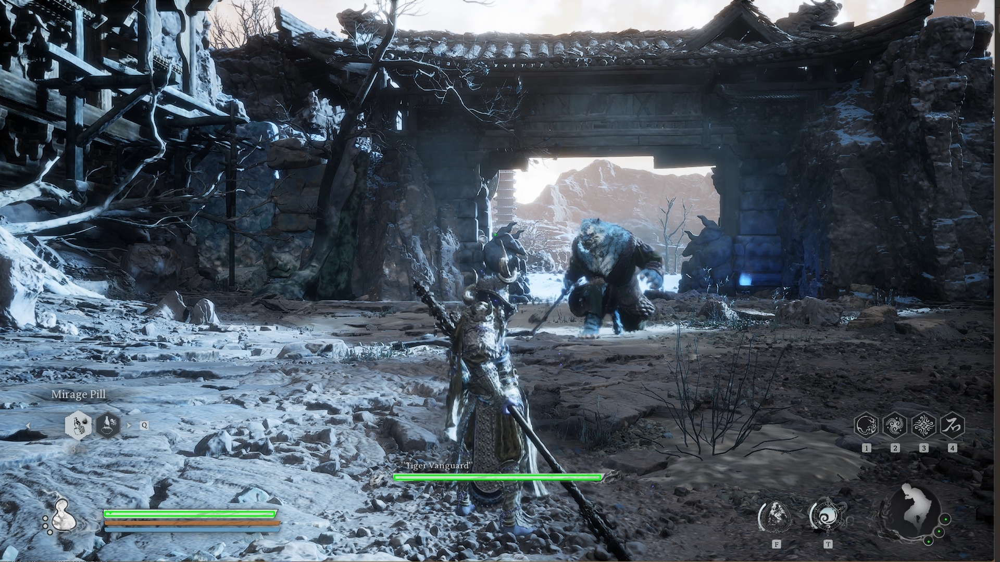
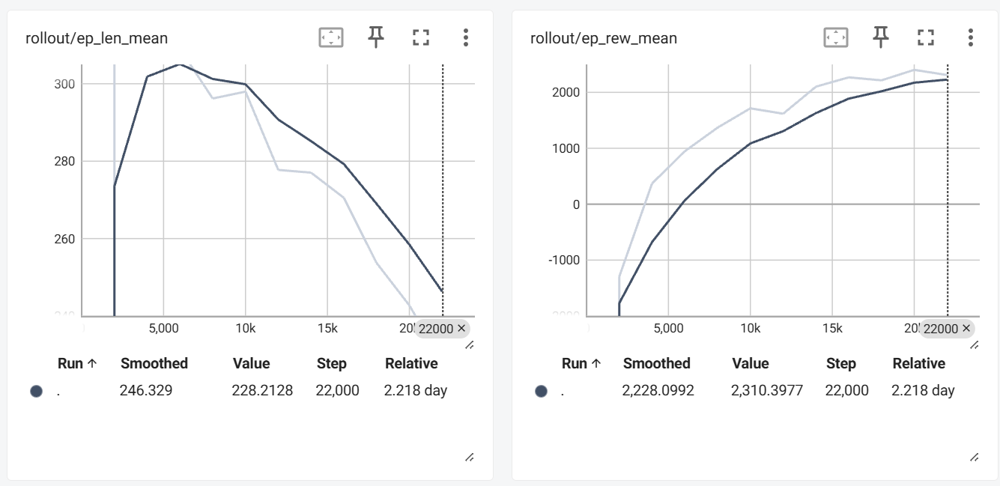

## Video

<iframe width="560" height="315" src="https://www.youtube.com/embed/YnIWhCEB3hk" frameborder="0" allowfullscreen></iframe>

## Project Summary
The ultimate goal of this project is to create an AI agent that can defeat the bosses in a Chinese Action RPG called Black Myth: Wukong. 

One major intuition of implementing this AI agent is to potentially help some players who might need assistance in this challenging RPG.

So why this project is not trivial? The reasons can be different bosses have complicated moves, and our Bot has to make the correct decision based on these screenshot (containing too many details and possibilities at different given frames), which cannot be hard-coded at all. That's why we need an AI agent that can learn these by itself in order to make this project possible.

The inputs for our AI agent are the captured screenshot, the boss and player HP bars during the gameplay; on the other hand, the output is a model that is able to take actions to earn rewards as high as possible.

## Approach
For the initial baseline approaches, we have the screenshot, boss hp bar, and player hp percentage with stamina as input; we also have both trivial actions and those are not, including simple four-direction movements(wasd) and combined actions like jump attack.

Admittedly, this baseline approaches seems great, since we have lots of actions, flexible indeed! So our final AI agent should be able to handle very complicated cases! However, this approach did not work very well in the end because: 
1. Stamina is not that important as an input for our AI agent. Letting it be one of the inputs might trivialize the decisions.
2. Too many actions will greatly increase the cost of training, especially some nonsense actions like moving left and right (therefore, it can be reduced to moving forward and backward).
3. Actions with multiple moves could be very time-consuming, and, in reality, the AI agent should be able to learn these combinations by itself somehow.

We discussed it thoroughly, and finally came up an optimized version of our project:

The final AI agent utilizes Proximal Policy Optimization (PPO), a policy gradient method designed to improve stability and convergence during training by OpenAI. PPO is particularly effective in environments with large action spaces and high-dimensional inputs.

During the game, the AI agent controls a character and takes actions based on the game scenario. To set up the environment, we extract the character's and boss's health bars, process the real time screenshot into a numpy matrix, and include the last 10 actions taken. Compare to baseline approach, the stamina is abandoned because of its unnecessary nature. These form the observation space, which represents the environment.

Next, we define 12 available actions for the AI to choose from, such as moving forward or backward, dodging, light and heavy attacks, charging a heavy attack, casting 4 different spells, and more. Combined actions are eliminated since they are too time-consuming. The AI will decide which action to take based on the current state of the environment.

Finally, we establish the reward system. There are two types of rewards:

1. One-time rewards: These include positive rewards for healing the character and damaging the boss, as well as negative rewards when the character takes damage from the boss.

2. Long-term rewards: These are given at each step and include:
- A positive reward for avoiding damage from the boss for more than 4 seconds;
- A negative reward for failing to damage the boss for 4 seconds;
- A positive reward based on how low the boss's health is;
- A negative reward when the player’s health is low.

These rewards encourage the AI to make good decisions, such as healing when its health is low, attacking the boss effectively, and avoiding damage.

After setting up the program, we begin to train the model by letting AI agent challenge the boss again and again. For now, we have trained it for more than 40k steps.

In this project, we used mss for screenshot; gym and stable-baselines3 for training AI agent; opencv-python, matplotlib and numpy for image processing; pytesseract for text identification; pydirectinput for keyboard controlling.

## Evaluation
The goal of this project is simple and straightforward - defeat the boss. Based on our reward settings, the AI agent will earn rewards for any action that helps it to defeat the boss and remain alive. As a result, the higher the final reward is, the better our model performs.

The plots of ep_len_mean and ep_rew_mean show how our model performs over the course of training. ep_len_mean represents the average length of the episodes (measured in time steps, with each episode being 2000 steps), while ep_rew_mean tracks the average reward the agent receives per episode, reflecting its performance based on the reward structure we’ve defined.

Between 0 and 5000 steps, the agent explored strategies to earn higher rewards. It finds out one way is to simply live longer, this led to an increase in ep_len_mean, as the agent uses more healing and dodge, which took longer to complete episodes. Since 5,000 steps, the agent became more familiar with fighting, it finds out that sometimes choose attack can earn it higher scores than heal or dodge, which caused ep_len_mean to decrease. This is also reflected in ep_rew_mean, which has been steadily increasing since the 5000 step. This means our ai agent always tries to find a way to earn higher rewards.

## Reference
SPECIAL THANKS to EldenRL repository, for providing us the inspiration to make this project possible; link: https://github.com/ocram444/EldenRL

SPECIAL THANKS to OpenAI Gym package, for providing us a simple way to train our AI agent; link: https://github.com/openai/gym

SPECIAL THANKS to Black Myth: Wukong, for providing us this excellent RPG with vivid images displayed in our website; link: https://www.heishenhua.com/

## AI Tool Usage
We utilized OpenAI ***chatgpt*** for debugging our code and optimize the speed of our code.

We imported ***gym***, an API standard for reinforcement learning, as a basic RL API to connect the game.
