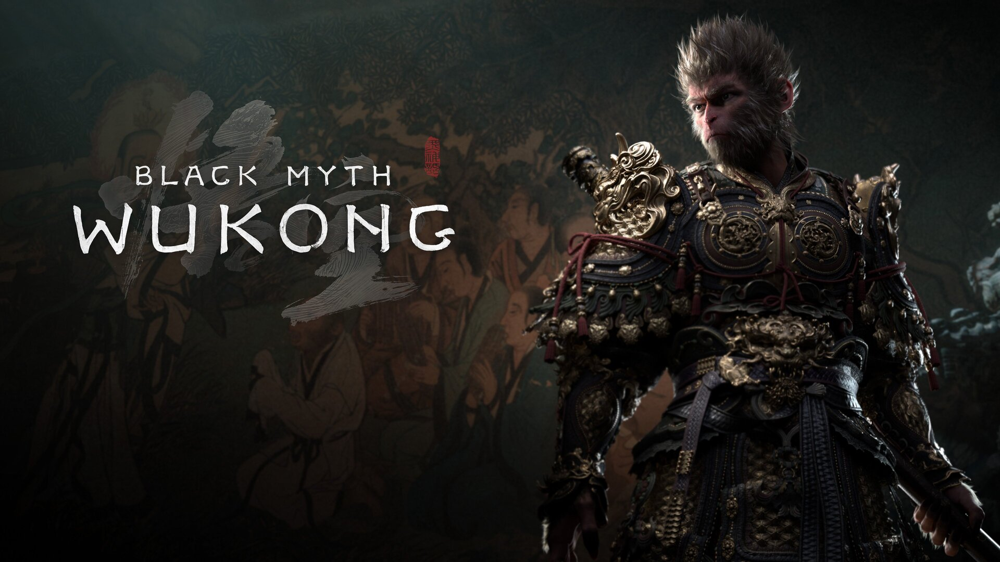

**Source code:** https://github.com/Jack-Emerald/BlackMyth-Unified_Mind

**Reports:**

- [Proposal](proposal.html)
- [Status](status.html)
- [Final](final.html)

**Description:**

Black Myth: Wukong is a Chinese Action RPG released 
in 2024.8.20. In this project, we are trying to train an AI 
agent to completely defeat bosses in Challenge mode by itself.
The AI agent should be able to beat the bosses by choosing 
series of best actions from our provided action poll.
The project is still in progress, but we can promise this is 
one of the coolest project we have decided to make.
