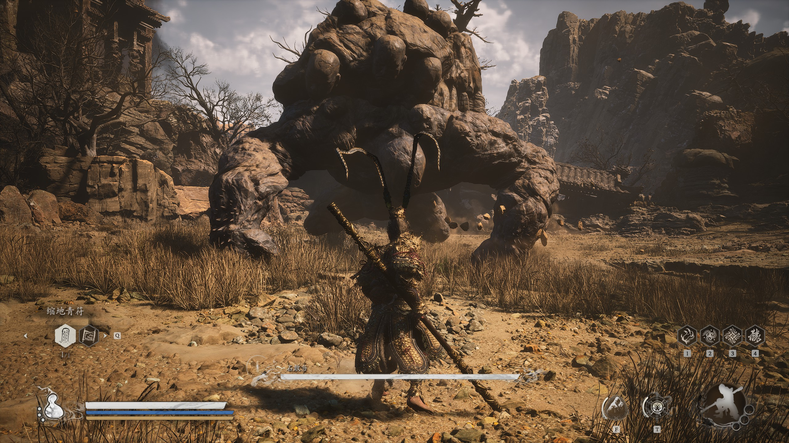
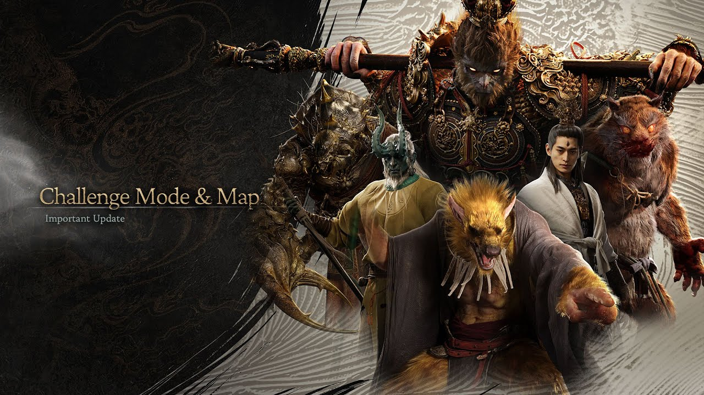

## Summary of the Project
Our goal is to create an AI agent that can defeat the bosses in a video game called Black Myth: Wukong, which is a Chinese Action RPG. 

Currently, we consider the input for our AI is the screen capturing during the game, including then boss and player HP bars, and the output should be a model that is able to take actions to beat the bosses based on the in game screen capturing.

The application of this project includes making reliable AI agent that may help the user to choose the best strategy for defeating the boss in an Action RPG.

## AI/ML Algorithms
We are going to use reinforcement learning with Proximal Policy Optimization together with screen capture and keyboard/mouse control to complete this project.

## Evaluation Plan

Black Myth: Wukong is an Action RPG. During the game, the player will encounter different bosses with different ways of attacking, and in Challenge mode, the player has the chance to challenge a chosen boss repeatedly. As a successful AI, it should be able to decide the best action to make in order to avoid taking too much damage which will lead to death and to defeat the boss ultimately.

Since beating the boss is the ultimate goal, the higher percent of tries the agent kills the boss, the better it performs. We expect our AI can only choose random actions at the beginning of project. However, as it improves from reinforcement learning, it should learn how to defeat the boss with optimal poll of actions. Our moonshot case can be how to train a common model that fits for challenging most or even all bosses in the game.

To test whether there is an overfit situation, we may train our model by using different equipments, combinations of spells, and so on. Meanwhile, we will try to train a common model in the end to see whether we can achieve the moonshot case. At first, the equipments provided to the AI agent will be in high level, but the difficulty(low-level equipments, etc.) will gradually increase, so that we can see the overall performance of our AI.

## Meet the Instructor
1st: 2025/1/20 10:15am PST

2nd: 2025/2/10 10:30am PST

## AI Tool Usage
We are going to use ***chatgpt*** for debugging our code or optimize the speed of our code if possible.

We plan to use ***gym***, an API standard for reinforcement learning, as a basic RL API to connect the game. However, since we cannot directly connect to the game to extract data directly, usage of screen-capturing and mouse-controlling is inevitable.
