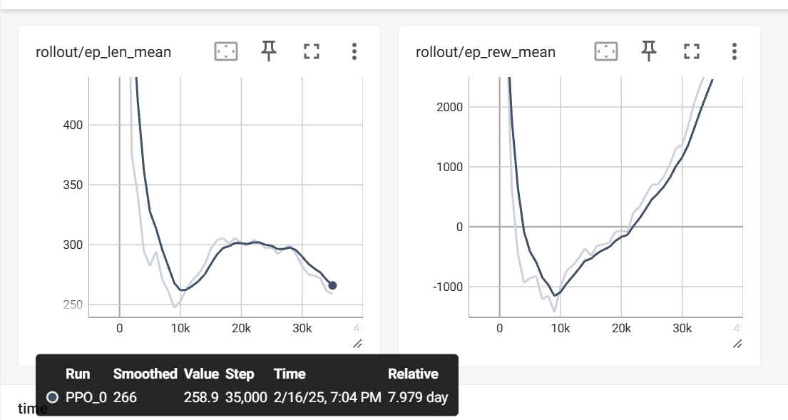

## Video

<iframe width="560" height="315" src="https://www.youtube.com/embed/QfKq2T2C9PI" frameborder="0" allowfullscreen></iframe>

## Project Summary
Our goal is to create an AI agent that can defeat the bosses in a video game called Black Myth: Wukong, which is a Chinese Action RPG. 

Currently, we consider the input for our AI is the screen capturing during the game, as well as the boss and player HP bars, and the output should be a model that is able to take actions to earn the highest possible rewards.

The application of this project includes making reliable AI agent that may help the user to choose the best strategy for defeating the boss in an Action RPG.

## Approach
The agent uses Proximal Policy Optimization (PPO), a policy gradient method designed to improve stability and convergence during training. PPO is particularly effective in environments with large action spaces and high-dimensional inputs.

During the game, the AI agent controls a character and takes actions based on the game scenario. To set up the environment, we extract the character's and boss's health bars, process the real time screenshot into a numpy matrix, and include the last 10 actions taken. These form the observation space, which represents the environment.

Next, we define 12 available actions for the AI to choose from, such as moving forward or backward, dodging, light and heavy attacks, charging a heavy attack, casting 4 different spells, and more. The AI will decide which action to take based on the current state of the environment.

Finally, we establish the reward system. There are two types of rewards:

1.One-time rewards: These include positive rewards for healing the character and damaging the boss, as well as negative rewards when the character takes damage from the boss.

2.Long-term rewards: These are given at each step and include:
A positive reward for avoiding damage from the boss for more than 4 seconds;
A negative reward for failing to damage the boss for 4 seconds;
A positive reward based on how low the boss's health is;
A negative reward when the player’s health is low.

These rewards encourage the AI to make good decisions, such as healing when its health is low, attacking the boss effectively, and avoiding damage.

After setting up the program, we begin to train the model by letting AI agent challenge the boss again and again. For now, we have trained it for more than 40k steps.

## Evaluation

The plots of ep_len_mean and ep_rew_mean show how our model performs over the course of training. ep_len_mean represents the average length of the episodes (measured in time steps, with each episode being 2000 steps), while ep_rew_mean tracks the average reward the agent receives per episode, reflecting its performance based on the reward structure we’ve defined.

At around 10,000 steps, there is a significant shift in the results. This is due to an issue with the initial reward setup, where the negative reward for taking damage was too high. As a result, the agent started avoiding fights by running away from the boss. After adjusting the reward policy, the agent began learning more appropriate behaviors.

Between 10,000 and 20,000 steps, the agent explored strategies to earn higher rewards, it finds one way to earn score is to simply survive, so it heals very frequently and prefers dodge rather than attack. This led to an increase in ep_len_mean, as the agent took longer to complete episodes. From 20,000 to 35,000 steps, the agent became more familiar with fighting the boss and even started winning at times, it finds out that sometimes choose attack can earn it higher scores than heal or dodge, which caused ep_len_mean to decrease. This is also reflected in ep_rew_mean, which has been steadily increasing since the 10k mark, though it has not yet stabilized.

## Remaining Goals and Challenges
To improve the agent's versatility and robustness, we need to train it against a variety of bosses with different behaviors and difficulty levels. This will help the agent generalize its strategies and adapt to different scenarios.

Lowering or adjusting the equipment the agent uses will allow us to test its ability to perform effectively under different conditions. By limiting resources, we can push the agent to make smarter decisions and use its actions more strategically.

One of the main goals is to create a single, generalized model that can handle different bosses and scenarios without needing separate models for each. This would reduce the overhead of training multiple models and allow the agent to adapt its strategy based on the environment automatically.

## Resources Used
SPECIAL THANKS to EldenRL repository, for providing us the inspiration to make this project possible, link: https://github.com/ocram444/EldenRL

In this project, we used mss for screenshot; gym and stable-baselines3 for training AI agent; opencv-python, matplotlib and numpy for image processing; pytesseract for text identification; pydirectinput for keyboard controlling.
